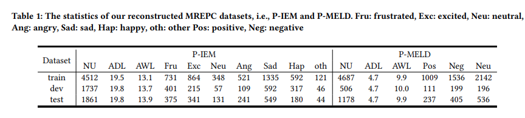
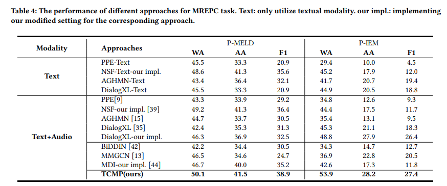

# Real-time Emotion Pre-Recognition in Conversations with Contrastive Multi-modal Dialogue Pre-training
 Thanks for your stay in this repo.
 This project aims to pre-recognize the real-time emotion in multimodal conversation [paper](https://dl.acm.org/doi/10.1145/3583780.3615024)

# 🔎 Motivation
The objective is to predict the emotion of a forthcoming target
utterance that is highly likely to occur. We believe that this task can
enhance the dialogue system’s understanding of the interlocutor’s
state of mind, enabling it to prepare an appropriate response in
advance.

# ⚙️ Installation
Make sure the following dependencies are intalled.
- python 3.6
- pytorch 1.7
- Numpy 1.19.2
- tqdm 4.62.3
- json 2.0.9
- argparse 1.1

## 💾 dataset
- Unlabelled Multi-modal Dialogues. Our unlabelled multimodal dialogues data is collected from TV series Friends, namely UMD.  Table 2 shows the
statistics of the unlabelled multi-modal dialogues data. 
- Muti-modal Emotion Pre-recognition Datasets. We evaluate
our proposed approach TCMP on two multi-modal dialogue emotion datasets, namely P-IEM and P-MELD. 1) P-IEM comes from
IEMOCAP[2]: A multimodal conversational dataset for emotion
recognition, which includes nine classes: neutral, happy, sad, angry,
frustrated, surprised, fear, disgusted and excited. 2) P-MELD comes
from MELD [30]: A multimodal dataset for emotion recognition
collected from the TV show Friends, which contains three coarsegrained classes: positive, neutral, negative. To adapt our emotion
pre-recognition task, we reconstruct both datasets. The statistics summary of them are shown in Table 1.

## 🚀 Quick start
There are two steps for training.
- First, preprocess the dataset with : bash preprocess.sh . You can also used the provided data, which is already processed.
- Second, pretrain with UMD: bash exec_scr.sh
- Third, finetune with P-IEM and P-MELD : bash exec_emo.sh
- Finally, evaluate the model 

### Download 
- [download](https://www.alipan.com/s/E4m3NJaNhWH) code:  0l6q
<!-- - [Unlabelled Multi-modal Dialogues]()  
- [P-IEM]()  
- [P-MELD]()  -->

<!-- ### step 2 -->

## 🏁 Experiment 

## 📜Citation

@inproceedings{ju2023real,  
  title={Real-time Emotion Pre-Recognition in Conversations with Contrastive Multi-modal Dialogue Pre-training},  
  author={Ju, Xincheng and Zhang, Dong and Zhu, Suyang and Li, Junhui and Li, Shoushan and Zhou, Guodong},  
  booktitle={Proceedings of the 32nd ACM International Conference on Information and Knowledge Management},  
  pages={1045--1055},  
  year={2023}  
}
## 🤘Furthermore

if your have any quesions, you can just propose the confusion in issue window. We are honored to disscuss the problem with you!

Thanks~
